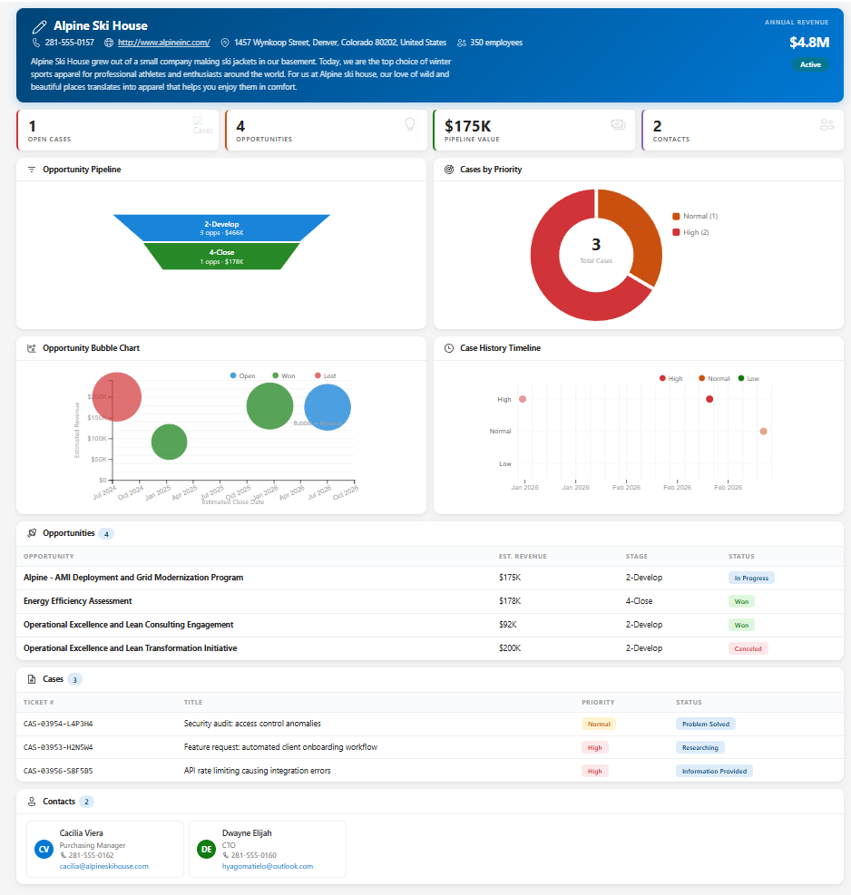
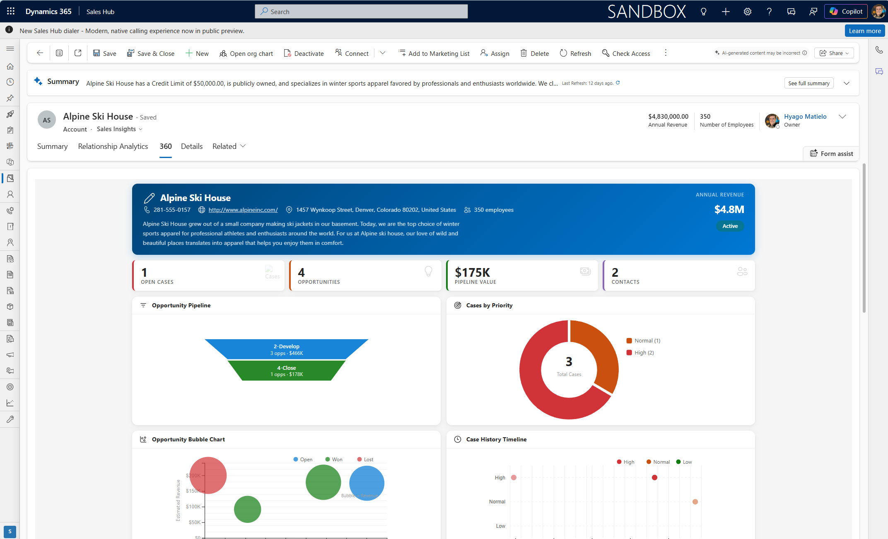

# Account 360 Dashboard for Dynamics 365

A full-width account dashboard designed to be embedded as a dedicated tab on the Account form in Microsoft Dynamics 365 Sales. Provides a comprehensive 360-degree view of any account with interactive charts and data tables.

## Screenshots

| Dashboard View | Embedded in Dynamics 365 |
|:--------------:|:------------------------:|
|  |  |

## What It Does

When placed in a "360" tab on an Account record, this dashboard displays:

- **Account header** — name, phone, website, address, employees, annual revenue, and active/inactive status badge.
- **KPI strip** — Open Cases, Opportunities, Pipeline Value, and Contact count at a glance.
- **Interactive charts** (powered by D3.js):
  - Opportunity Pipeline — bar/funnel chart by sales stage
  - Cases by Priority — donut chart breakdown
- **Data tables**:
  - Opportunities — name, value, stage, and status with color-coded badges
  - Cases — ticket number, title, priority, and status
  - Contacts — avatar, name, title, email, and phone
- **Responsive layout** — adapts to different form widths.

## Files

| File | Purpose |
|------|---------|
| `customer360.html` | Main dashboard web resource |
| `account-form.xml` | Form XML snippet for embedding the dashboard in a dedicated tab |

## How to Use It

1. **Upload as a Web Resource** — create a new HTML web resource using the `customer360.html` file.
2. **Add to the Account Form** — either add the web resource to an existing tab or use the `account-form.xml` as a reference for creating a dedicated 360 tab.
3. **Publish** — save and publish the form.

No additional servers or installations required. Everything runs inside Dynamics 365 using the built-in Web API.

## Requirements

- Microsoft Dynamics 365 Sales (online)
- D3.js is loaded from CDN (`https://d3js.org/d3.v7.min.js`)

## License

[MIT](LICENSE.txt)
